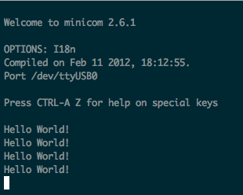

# KOZOS YARUZE PROJECT



* binutil-2.19.1
* gcc 4.3.6 (gcc-3.4.6 couldn't compile) 

To build gcc

needed to add  
`--disable-libssp` and  
`--disable-werror` (not sure this is needed)

configure and make in a subdirectory is the key

```
$ cd gcc-4.3.6
$ mkdir h8300-elf
$ cd h8300-elf  
$ ../configure ...
$ make -j
# make install
```
